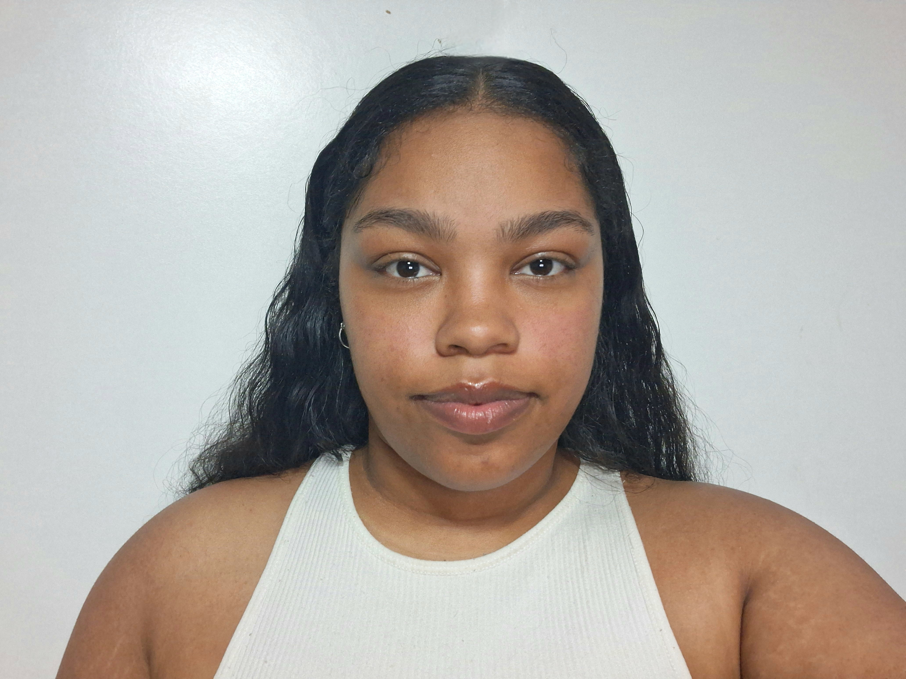

# ROBYN DOMINIQUE STEVENS
---

<table>
  <tr>
    <td>
      
    </td>
    <td>
      <strong>Applications Development Student</strong> 
      📍 Parow, Western Cape 
      📧 222201789@mycput.ac.za 
      📞 +27 65 953 6191 
      🔗 <a href="https://github.com/Robyn-D-Stevens">GitHub</a> 
      🔗 <a href="https://linkedin.com/in/robyn-d-stevens">LinkedIn</a>
    </td>
  </tr>
</table>

---

## 🎓 Education
<table>
  <tr>
    <td><strong>NSC Certificate</strong></td>
    <td>Breidbach Senior Secondary School</td>
    <td>Qonce - EC</td>
    <td>2020</td>
  </tr>
  <tr>
    <td><strong>IT Computer Literacy Certificate</strong></td>
    <td>Phoenix College</td>
    <td>Qonce - EC</td>
    <td>2022</td>
  </tr>
  <tr>
    <td><strong>Diploma in ICT Applications Development (Incomplete)</strong></td>
    <td>Durban University of Technology</td>
    <td>Durban - KZN</td>
    <td>2023</td>
  </tr>
  <tr>
    <td><strong>Diploma in ICT Applications Development</strong></td>
    <td>Cape Peninsula University of Technology</td>
    <td>Cape Town - WC</td>
    <td>2024 – Present</td>
  </tr>
</table>

---

## 💻 Technical Skills
- Java  
- C#  
- MySQL  
- HTML/CSS  
- JavaScript  
- Microsoft Office Suite  
- Git/GitHub  
- Visual Studio Code  
- Visual Studio  
- Figma  

---

## 🏆 Experience
**Soundboard and Media Operator – Volunteer**  
Bethany Emmanuel Baptist Church, Qonce - EC | 2022 – Present  
- Operated soundboard and managed projector media weekly  
- Ensured smooth technical proceedings during services and events  

**Class Representative and Collaboration**  
Durban University of Technology, Durban - KZN | 2023  
- Liaised between 300+ students, IT department, and faculty  
- Applied leadership and project management skills by initiating, organizing, and coordinating group assignments  

---

## 📂 Projects
**GOTS Car Rental System | C#**  
- Developed a car rental system in C# using Stream I/O for data storage and retrieval  
- Refined system logic and interface with lead developer to ensure usability and accuracy  
- Contributed to subsystem development and documentation  
- Maintained reliability by creating a GitHub backup repository  
🔗 <a href="https://github.com/Robyn-D-Stevens/GOTS-Car-Maintenance-App-APDP1">GOTS Car Rental App</a> 

**CPUT Stays Student Accommodation | HTML, CSS, JavaScript, MySQL, PHP**  
- Led the project, coordinated tasks, and ensured milestones were met  
- Structured documentation and guided team communication  
- Assisted in database schema design and SQL integration for student accommodation records and booking workflows  
🔗 <a href="https://github.com/Robyn-D-Stevens/MySQL-for-CPUT_Stays">CPUT Stays Repo (MySQL Base)</a> 
  
---

## 📇 References
**Fezeka Tukuta** – Deputy Principal, Teleios Christian School  
📧 school.emailtukutukutaf1@gmail.com  
📞 +27 430 040 236 (Work) | +27 719 891 900 (Cell)  

**Nosipho Ngwenya** – Student, Durban University of Technology  
📧 technerdnosipho@gmail.com  
📞 +27 818 822 897

---

## 📹 Mock Interview Video
<video width="640" height="360" controls>
  <source src="video/Interviewss.mp4" type="video/mp4">
</video>

## 🪞Mock Interview and GitHub Pages Reflection
While completing the interview, it seemed easy in theory and to the point regarding the STAR method. However, in practice it was difficult because of overlapping information and the fact that I had a lot to say that was on topic. Initially, I had a 7-minute video that shared many of my opinions and experiences. I later figured I could reduce this and managed to get it under 3 minutes, which made me realize how short an interview can be. It did not truly feel like I was able to market myself properly, which might be a hindrance in future but it was needed to workshop that skill. Ultimately, this experience has had its pros and cons and will definitely prepare me for future interviews.

Regarding GitHub Pages, it was fairly simple to deploy to and do in markdown. The only issues I had were figuring out the tables and formatting so that the page would look better and feel more like a CV given the assignment. However, I managed to figure it out and get everything needed into it per the brief. Learning Markdown has refreshed my knowledge of HTML tags and structure, given that I had to use it to add some tables that conflicted with some of my formatting and text. I managed to pull what I wanted off and it looks decent.
